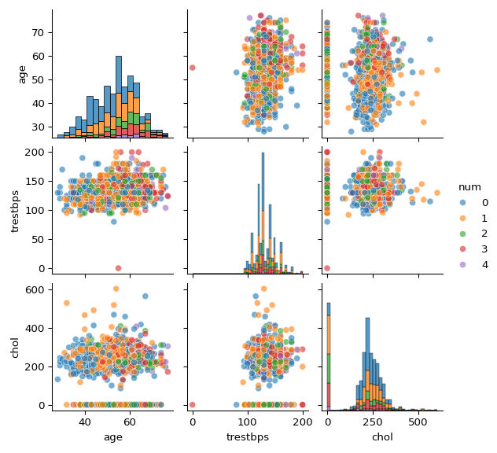

Machine Learning Intro in Python
================
Ricardo A. DeMoya
7/6/2023

## A quick introduction to machine learning

Most of the world is familiar with the phrase “machine learning” (ML).
Here we hope to introduce you to `sklearn` a python package with
applicable use cases and training in ML.

``` python
import sklearn as sk
import numpy as np
import pandas as pd
import matplotlib.pyplot as plt
import matplotlib.ticker as mtick
import seaborn as sb
```

## Heart Disease prediction

Here we use a dataset sourced from kaggle.com to try and build a ML
model to predict heart disease severity. You can download the data
[here](https://www.kaggle.com/datasets/redwankarimsony/heart-disease-data).
The data was collected from four locations containing 13
columns/features we can use to predict the heart disease group they
belong to, in the `num` column. The heart disease groups are as follows:

- 0 = no heart disease
- 1 = Mild Heart Disease types
- 2 = Moderate Heart Disease type
- 3 = Severe Heart Disease type
- 4 = Critical Heart Disease type

Reading in the data and setting the `id` column as the index.

``` python
df = pd.read_csv("data/heart_disease_uci.csv")
df = df.set_index('id')
df.head(n=5)
```

    ##     age     sex    dataset  ...   ca               thal  num
    ## id                          ...                             
    ## 1    63    Male  Cleveland  ...  0.0       fixed defect    0
    ## 2    67    Male  Cleveland  ...  3.0             normal    2
    ## 3    67    Male  Cleveland  ...  2.0  reversable defect    1
    ## 4    37    Male  Cleveland  ...  0.0             normal    0
    ## 5    41  Female  Cleveland  ...  0.0             normal    0
    ## 
    ## [5 rows x 15 columns]

### Data cleaning

In ML you have to understand the data you are using, it normally is not
free of missing data and can have biases. First we will check for
missing or `NA` values and decide what to do with them. Using
`df.info()` can help us see what kind of data each column is and how
many non-Null values exist. We know we have 920 rows or samples so
anything less than that means null values exist in that column.

``` python
df.info()
```

    ## <class 'pandas.core.frame.DataFrame'>
    ## Index: 920 entries, 1 to 920
    ## Data columns (total 15 columns):
    ##  #   Column    Non-Null Count  Dtype  
    ## ---  ------    --------------  -----  
    ##  0   age       920 non-null    int64  
    ##  1   sex       920 non-null    object 
    ##  2   dataset   920 non-null    object 
    ##  3   cp        920 non-null    object 
    ##  4   trestbps  861 non-null    float64
    ##  5   chol      890 non-null    float64
    ##  6   fbs       830 non-null    object 
    ##  7   restecg   918 non-null    object 
    ##  8   thalch    865 non-null    float64
    ##  9   exang     865 non-null    object 
    ##  10  oldpeak   858 non-null    float64
    ##  11  slope     611 non-null    object 
    ##  12  ca        309 non-null    float64
    ##  13  thal      434 non-null    object 
    ##  14  num       920 non-null    int64  
    ## dtypes: float64(5), int64(2), object(8)
    ## memory usage: 115.0+ KB

We can use `df.isna().sum()` to count how many `NAs` exist per column of
data and then plot the proportion.

``` python
NAs_df=df.isna().sum()
NAs_df = pd.DataFrame({"Cols":NAs_df.index,
                        "NAs":NAs_df.values})
NAs_df['Percent'] = NAs_df['NAs']/df.shape[0]


NAs_plot, ax =plt.subplots()
NAs_plot=sb.barplot(data=NAs_df,x="Cols",hue="Cols",y="Percent")
NAs_plot=plt.xticks(rotation=45, ha='right')
ax.yaxis.set_major_formatter(mtick.PercentFormatter(xmax=1.0))
NAs_plot=plt.xlabel("")
NAs_plot=plt.ylim(0,1)
NAs_plot=plt.ylabel("Proportion of\nNAs")
plt.tight_layout()
plt.show()
```


``` python
plt.close()
```

Now we can drop the columns with more than 25% `NA` proportion. It is
understandable that missing too much data in a column would make it
non-informative to the ML model.

``` python
cols_to_remove= NAs_df[NAs_df['Percent']>0.25]

df_cleaned = df.drop(columns=cols_to_remove['Cols'])
```

### Dealing with the remaining `NAs`

For the columns that have \<25% `NAs` we can use a number of ways to
impute values for them. First we will plot the data to look for outliers
and distribution of the columns with `NAs`. When the column has
significant outliers it is suggested to replace `NAs` with median values
in that column. We will plot these columns below labeling the outliers
in red.

``` python
#Outliers shapes and colors
outliers = dict(marker='*', markersize=8, markerfacecolor='red', markeredgecolor='red')

distr_plot=plt.figure()
distr_plot=sb.boxplot(data=df_cleaned[['trestbps','chol','thalch','oldpeak']],flierprops=outliers)
plt.show()
```


``` python
plt.close()
```

Since all the numerical data with `NAs` have significant outliers, we
will replace `NA` values with the median of that column. This data
cleaning should improve the predictive power of the ML model we build.

``` python
# replace NAs with medians
df_cleaned['trestbps'] = df_cleaned['trestbps'].fillna(df_cleaned['trestbps'].median())
df_cleaned['chol'] = df_cleaned['chol'].fillna(df_cleaned['chol'].median())
df_cleaned['thalch'] = df_cleaned['thalch'].fillna(df_cleaned['thalch'].median())
df_cleaned['oldpeak'] = df_cleaned['oldpeak'].fillna(df_cleaned['oldpeak'].median())
```

The `fbs` and `exang` columns have missing Boolean values so we need to
understand their relationship to the target which in our case is the
`num` column. The `fbs` column is data answering if fasting blood sugar
is greater than 120 mg/dl and for the 0-No heart disease group we see
majority False and for all the groups False values are the highest. A
common practice would be to replace all the missing values in this
column with False, but we will explore another option.

``` python
propfbs = df_cleaned['fbs'].value_counts(normalize=True)

fbs_num, ax = plt.subplots(1, 2)

fbs_num=sb.countplot(data=df, x='num', hue='fbs', stat='proportion', ax=ax[0])
ax[0].yaxis.set_major_formatter(mtick.PercentFormatter(xmax=1.0,decimals=0))
fbs_num = ax[0].set_xlabel("Heart Disease Groups",size=12)
fbs_num = ax[0].set_ylabel("fbs\nProportions", size=12)
fbs_num = ax[0].set_title("Per Group\nProportions", size=12)
fbs_num = ax[0].legend(title="high fasting blood sugar")

fbs_num=propfbs.plot(kind='bar', color=['skyblue', 'lightcoral'],ax=ax[1])
ax[1].yaxis.set_major_formatter(mtick.PercentFormatter(xmax=1.0,decimals=0))
fbs_num = ax[1].set_xlabel("")
fbs_num = ax[1].tick_params(axis='x', labelrotation=30)
fbs_num = ax[1].set_title("Total\nProportions",size=12)

plt.tight_layout()
plt.show()
```


``` python
plt.close()
```

The `exang` column answers if exercised induce angina occurred, we see a
more complex relationship with the target. Those with 0-No heart disease
do not have many True values while the heart disease categories all
consistently have more True values than False. We could replace the 0
group `exang` values with False and the other groups with True.

``` python
propexang = df_cleaned['exang'].value_counts(normalize=True)

ex_num, ax = plt.subplots(1, 2)

ex_num=sb.countplot(data=df, x='num', hue='exang', stat='proportion', ax=ax[0])
ax[0].yaxis.set_major_formatter(mtick.PercentFormatter(xmax=1.0,decimals=0))
ex_num = ax[0].set_xlabel("Heart Disease Groups",size=12)
ex_num = ax[0].set_ylabel("exang\nProportions", size=12)
ex_num = ax[0].set_title("Per Group\nProportions", size=12)
ex_num = ax[0].legend(title="exercise-induced angina")

ex_num=propexang.plot(kind='bar', color=['skyblue', 'lightcoral'],ax=ax[1])
ax[1].yaxis.set_major_formatter(mtick.PercentFormatter(xmax=1.0,decimals=0))
ex_num = ax[1].set_xlabel("")
ex_num = ax[1].tick_params(axis='x', labelrotation=30)
ex_num = ax[1].set_title("Total\nProportions",size=12)

plt.tight_layout()
plt.show()
```


``` python
plt.close()
```

Another way of dealing with the Boolean values in `fbs` and `exang` is
to randomly choose the values based on the overall proportions of True
and False in the column.

``` python
# Calculate the observed proportions of True and False
p_truefbs = df_cleaned['fbs'].mean()
p_falsefbs = 1 - p_truefbs

p_trueex = df_cleaned['exang'].mean()
p_falseex = 1 - p_trueex

# Get a Series of missing values
missing_valuesfbs = df_cleaned['fbs'].isna()
num_missingfbs = missing_valuesfbs.sum()

missing_valuesex = df_cleaned['exang'].isna()
num_missingex = missing_valuesex.sum()

# Generate random boolean values based on observed proportions
np.random.seed(42) # for reproducibility
random_imputationfbs = np.random.choice([True, False], size=num_missingfbs, p=[p_truefbs, p_falsefbs])

random_imputationex = np.random.choice([True, False], size=num_missingex, p=[p_trueex, p_falseex])

# Replace the NA values with the random imputation
df_cleaned.loc[missing_valuesfbs, 'fbs'] = random_imputationfbs
df_cleaned.loc[missing_valuesex, 'exang'] = random_imputationex
```

``` python
#Drops 2 rows from `restecg` difficult to impute
df_cleaned=df_cleaned.dropna()

#Check if all NAs are gone
df_cleaned.isna().sum()
```

    ## age         0
    ## sex         0
    ## dataset     0
    ## cp          0
    ## trestbps    0
    ## chol        0
    ## fbs         0
    ## restecg     0
    ## thalch      0
    ## exang       0
    ## oldpeak     0
    ## num         0
    ## dtype: int64

``` python
#How many samples do we have now
df_cleaned.shape
```

    ## (918, 12)

### Exploratory Data Analysis (EDA)

Here we will take a quick look at the data and try to understand what
kinds of questions we can ask of it. The power of machine learning is to
predict values from other values so let’s try to decide what to predict
from our heart disease data.

``` python
df_cleaned.head()
```

    ##     age     sex    dataset               cp  ...  thalch  exang oldpeak num
    ## id                                           ...                           
    ## 1    63    Male  Cleveland   typical angina  ...   150.0  False     2.3   0
    ## 2    67    Male  Cleveland     asymptomatic  ...   108.0   True     1.5   2
    ## 3    67    Male  Cleveland     asymptomatic  ...   129.0   True     2.6   1
    ## 4    37    Male  Cleveland      non-anginal  ...   187.0  False     3.5   0
    ## 5    41  Female  Cleveland  atypical angina  ...   172.0  False     1.4   0
    ## 
    ## [5 rows x 12 columns]

``` python
df_cleaned.shape # Returns (rows,columns)
```

    ## (918, 12)

### How many of each target class

What we can see is that the most patients are in the 0: No Heart Disease
and 1: Mild Heart Disease groups. This is good to keep in mind when
doing scoring of the ML model. Next we will try to decide what features
have the most meaningful relationship with our target class: heart
disease.

``` python
targetClasses, ax = plt.subplots()
targetClasses = sb.countplot(data=df_cleaned,x='num')
targetClasses = ax.set_xlabel("Heart Disease Groups",size=16)
targetClasses = ax.set_ylabel("Number of Patients",size=16)
plt.tight_layout()
plt.show()
```


``` python
plt.close()
```

### Relationships with heart disease

We use pair plots here to see any relationship between and continuous
data and the heart disease target categories.

``` python
pairdata= df_cleaned[['age','trestbps','chol','num']]

#pair2=plt.subplots()
# Create a PairGrid object
g = sb.PairGrid(pairdata, hue="num",height=2,palette=sb.color_palette(n_colors=5))

# Map the plots
g=g.map_upper(sb.scatterplot,alpha=0.6)
g=g.map_lower(sb.scatterplot,alpha=0.6)
g=g.map_diag(sb.histplot,multiple="stack")

# Add the legend outside the plot using bbox_to_anchor
g=g.add_legend()
g=g.tight_layout()
plt.show()
```



``` python
plt.close()
```

``` python
pairdata2= df_cleaned[['chol','thalch','trestbps','num']]
# Create a PairGrid object
p = sb.PairGrid(pairdata2, hue="num",height=2,palette=sb.color_palette(n_colors=5))

# Map the plots
p=p.map_upper(sb.scatterplot,alpha=0.5)
p=p.map_lower(sb.scatterplot,alpha=0.5)
p=p.map_diag(sb.histplot,multiple="stack")

# Add the legend outside the plot using bbox_to_anchor
p=p.add_legend()
p=p.tight_layout()
plt.show()
```


``` python
plt.close()
```

What are the age ranges of the heart disease data? We can see the
youngest is 28 and oldest of 77 years old. And how many are male or
female? We see a male bias in these samples, which makes sense since men
have double the chance of heart disease compared to women.

``` python
int(df_cleaned['age'].min()),int(df_cleaned['age'].max())
```

    ## (28, 77)

``` python
df_cleaned['sex'].value_counts()
```

    ## sex
    ## Male      724
    ## Female    194
    ## Name: count, dtype: int64

Let’s make a plot to illustrate the male bias.

``` python
sexfig= plt.figure()
sexfig= sb.histplot(data=df_cleaned, x='age', hue='sex',multiple="stack")
sexfig= plt.ylabel("Number of\nPatients", size=16)
sexfig= plt.xlabel("Age",size=16)
plt.tight_layout()
plt.show()
```


``` python
plt.close()
```

``` python
sexnum= plt.figure()
sexnum= sb.countplot(data=df_cleaned, x='num', hue='sex')
sexnum= plt.ylabel("Number of\nPatients", size=16)
sexnum= plt.xlabel("Heart Disease Groups",size=16)
plt.tight_layout()
plt.show()
```


``` python
plt.close()
```

The datasets column tells us where the samples came from. We can see
there is data from Cleveland, Hungary, Long Beach, and Switzerland.
Other than being a nice plot to understand the data, the place the data
comes from should have no contribution to heart disease severity so we
should remove this column before prediction. What is the distribution of
heart disease groups from each of these countries. No heart disease
groups 2 and above from Hungary.

``` python
df_cleaned['dataset'].value_counts()
```

``` python
data_hd_plot=plt.figure()
data_hd_plot = sb.countplot(data=df_cleaned,x='dataset',hue='num')
data_hd_X=plt.ylabel("Number of\nPatients", size=16)
data_hd_Y=plt.xlabel("")
plt.tick_params(axis='x', which='major', labelsize=14,rotation=30)
data_hd_legend=plt.legend(bbox_to_anchor=(1.02, 0.5), loc="center left")
plt.subplots_adjust(right=0.7,bottom=0.30)
plt.tight_layout()
plt.show()
```


``` python
plt.close()
```

Now a column that should have a relationship with heart disease severity
is the chest pain column or `cp`. This column tells us the type of
angina, or a lack of blood flow to the heart causing chest pain, the
patient had. If you had chest pain you would assume you have a higher
rate of heart disease. The plot below shows us that is not always true.
Asymptomatic patients, those that show no sign of disease contain the
most patients followed by atypical or non-classic angina.

``` python
cp_num = pd.crosstab(df_cleaned['cp'],df_cleaned['num'])
cp_numPlot= cp_num.plot(kind="bar")
cp_numPlot= plt.xlabel("Chest Pain")
plt.tick_params(axis='x', which='major', labelsize=14,rotation=30)
cp_numPlotlegend= plt.legend(bbox_to_anchor=(1.02, 0.5), loc="center left",
labels=['0: No Heart Disease','1: Mild HD','2: Moderate HD','3: Sever HD','4: Critical HD'])
plt.tight_layout()
plt.show()
```


``` python
plt.close()
```

### EDA summary

The data had many interesting patterns. There was many `NA` values in a
few columns of data which were removed and `NA` data left was replaced
by the median value of that column. Then we can see that there is a
clear male bias in the data and this existed in all the datasets that
make up this data. We see that when plotting chest pain and the heart
disease severity classification that the asymptomatic patients had the
most cases of severe and critical heart disease. The most data we have
fall in the no heart disease group meaning we should use methods for
unbalanced data.

### Now for the prediction

We will now get the data separated into features (X) and target (y) and
split it into train and test data. Then we will encode all the
categorical data with `LabelEncoder()`. The target to predict is heart
disease in the `num` column.

- 0 = no heart disease
- 1 = Mild Heart Disease types
- 2 = Moderate Heart Disease type
- 3 = Severe Heart Disease type
- 4 = Critical Heart Disease type

Preparing the data for prediction we need to remove features/columns
that we know do not contribute to heart disease like the patient ID, the
hospital the data comes from and last the target itself so we cn predict
that value.

``` python
from sklearn.preprocessing import LabelEncoder
from sklearn.metrics import classification_report, confusion_matrix, average_precision_score ,roc_auc_score, accuracy_score, precision_score
from sklearn.pipeline import make_pipeline, Pipeline
from sklearn.model_selection import train_test_split

ids = df_cleaned.index
X = df_cleaned.drop(['dataset','num'], axis=1)
y = df_cleaned['num']

#Convert the categorical data to numbers
encoder = LabelEncoder()

for col in X.columns:
    if X[col].dtype == 'object' or X[col].dtype == 'category':
        X[col] = encoder.fit_transform(X[col])
    else:
        pass

X_train, X_test, y_train, y_test,ids_train,ids_test = train_test_split(X, y,ids, test_size=0.3, random_state=42)
```

### The finish line first

The target data is made up of 5 classes with more patients in the No
heart disease group than the others and very few critical heart disease
patients. So, with an imbalanced dataset using the Area Under the
Receiver Operating Characteristic Curve (ROC AUC) from `sklearn.metrics`
is a better measure of the models ability to differentiate between the
target classes. After testing many variations we landed on the following
set up, providing a 78.8% accuracy.

``` python
from sklearn.preprocessing import StandardScaler
from sklearn.ensemble import RandomForestClassifier
from sklearn.feature_selection import RFE, SelectKBest, f_classif, SelectFromModel
from sklearn.metrics import classification_report, confusion_matrix, average_precision_score ,roc_auc_score

#Best accuracy at 78.5%
estimatorRF = RandomForestClassifier(max_depth=10,random_state=42)
pipeRF = make_pipeline(StandardScaler(), SelectKBest(score_func=f_classif, k=10), estimatorRF)
fitRF = pipeRF.fit(X_train,y_train)
predRF = pipeRF.predict(X_test)
predRFprob = pipeRF.predict_proba(X_test)
RFaccur = accuracy_score(y_test,predRF)
RFprec = precision_score(y_test,predRF,average='weighted')
RFrocauc = roc_auc_score(y_test,predRFprob,multi_class='ovr')
RFprecision = average_precision_score(y_test,predRFprob)
RFclassReport = classification_report(y_test,predRF)
print(f"ROC-AUC of Random Forest: {RFrocauc:.4f}")
```

    ## ROC-AUC of Random Forest: 0.7888

``` python
print(f"Average Precision of Random Forest: {RFprecision:.4f}")
```

    ## Average Precision of Random Forest: 0.4162

``` python
print(f"Accuracy Score of Random Forest: {RFaccur:.4f}")
```

    ## Accuracy Score of Random Forest: 0.5616

``` python
print(f"Precision of Random Forest: {RFprec:.4f}")
```

    ## Precision of Random Forest: 0.5024

### How we got to the finish line

First we tried our top three choice models for classification and tested
the accuracy of them. Here we introduce pipelines a way to generate
reproducible model designs. These are the most basic pipelines that
contain a scaler and the model for testing.

``` python
from sklearn.preprocessing import StandardScaler
from sklearn.svm import LinearSVC
from sklearn.ensemble import RandomForestClassifier
from sklearn.neighbors import KNeighborsClassifier

# Making pipelines to keep consistent processing of the data
LSVCpipe = make_pipeline(StandardScaler(),
                    LinearSVC(random_state=42, tol=1e-5))
                    
RFpipe = make_pipeline(StandardScaler(),
                    RandomForestClassifier(max_depth=10,random_state=42))

Knnpipe =make_pipeline(StandardScaler(),
                    KNeighborsClassifier())
```

### Linear SVC model

``` python
LSVCfit = LSVCpipe.fit(X_train,y_train)
LSVCpred = LSVCpipe.predict(X_test)
# Combine predictions with corresponding IDs
LSVCresults = pd.DataFrame({'id': ids_test, 'predicted_target': LSVCpred})

LSVCaccuracy = accuracy_score(y_test, LSVCpred)
print(f"Linear SVC Accuracy: {LSVCaccuracy:.4f}")
```

    ## Linear SVC Accuracy: 0.5435

### Random Forest model

``` python
RFfit = RFpipe.fit(X_train,y_train)
RFpred = RFpipe.predict(X_test)
RFaccur = accuracy_score(y_test,predRF)
RFprec = precision_score(y_test,predRF,average='weighted')

RFprob = RFpipe.predict_proba(X_test)
RFrocauc = roc_auc_score(y_test,RFprob,multi_class='ovr')
RFprecisionave = average_precision_score(y_test,RFprob)

print(f"ROC-AUC of Random Forest: {RFrocauc:.4f}")
```

    ## ROC-AUC of Random Forest: 0.7888

``` python
print(f"Average Precision of Random Forest: {RFprecisionave:.4f}")
```

    ## Average Precision of Random Forest: 0.4162

### KNN model

``` python
Knnfit=Knnpipe.fit(X_train, y_train)
Knnpred = Knnpipe.predict(X_test)
Knnprob = Knnpipe.predict_proba(X_test)

knn_roc = roc_auc_score(y_test,Knnprob,multi_class='ovr')
knn_accuracy = accuracy_score(y_test, Knnpred)
print(f"KNN ROC-AUC: {knn_roc:.4f}")
```

    ## KNN ROC-AUC: 0.7065

``` python
print(f"KNN Accuracy: {knn_accuracy:.4f}")
```

    ## KNN Accuracy: 0.5399

### Increasing the accuracy of our model

There are several things we can try to increase our accuracy. First we
will try a different scaler.

``` python
from sklearn.preprocessing import MinMaxScaler

# Making pipelines to keep consistent processing of the data
LSVCpipeMax = make_pipeline(MinMaxScaler(),
                    LinearSVC(random_state=42, tol=1e-5))
                    
RFpipeMax = make_pipeline(MinMaxScaler(),
                    RandomForestClassifier(max_depth=10,random_state=42))

KnnpipeMax =make_pipeline(MinMaxScaler(),
                    KNeighborsClassifier())
```

Unfortunately this did not increase the accuracy for all models.

``` python
LSVCfitMax = LSVCpipeMax.fit(X_train,y_train)
LSVCpredMax = LSVCpipeMax.predict(X_test)
LSVCaccuracy = accuracy_score(y_test, LSVCpredMax)
print(f"Linear SVC Accuracy with MinMaxScaler: {LSVCaccuracy:.4f}")
```

    ## Linear SVC Accuracy with MinMaxScaler: 0.5471

``` python
RFfitMax = RFpipeMax.fit(X_train,y_train)
RFpredMax = RFpipeMax.predict(X_test)
RFprobMax = RFpipeMax.predict_proba(X_test)
RFrocaucMax = roc_auc_score(y_test,RFprobMax,multi_class='ovr')
RFaccuracyMax = accuracy_score(y_test,RFpredMax)
print(f"Random Forest ROC-AUC with MinMaxScaler: {RFrocaucMax:.4f}")
```

    ## Random Forest ROC-AUC with MinMaxScaler: 0.7888

``` python
print(f"Random Forest Accuracy with MinMaxScaler: {RFaccuracyMax:.4f}")
```

    ## Random Forest Accuracy with MinMaxScaler: 0.5652

``` python
KnnfitMax=KnnpipeMax.fit(X_train, y_train)
KnnpredMax = KnnpipeMax.predict(X_test)
KnnprobMax = KnnpipeMax.predict_proba(X_test)
knn_rocMax = roc_auc_score(y_test,Knnprob,multi_class='ovr')
knn_accuracyMax = accuracy_score(y_test, KnnpredMax)
print(f"KNN Accuracy with MinMaxScaler: {knn_accuracy:.4f}")
```

    ## KNN Accuracy with MinMaxScaler: 0.5399

``` python
print(f"KNN ROC-AUC with MinMaxScaler: {knn_rocMax:.4f}")
```

    ## KNN ROC-AUC with MinMaxScaler: 0.7065

### Try to reduce dimensionality

We could manually choose the columns or features that provide the most
information for the ML model based on knowledge about heart disease.
Another method would be to have an unbiased scoring system to choose the
features that have the most information about the target. The `sklearn`
package has tools to do this; `SelectKBest`, Recursive Feature
Elimination (`RFE`), and `SelectFromModel` allow for filter, wrapper,
and embedded methods of feature selection.

``` python
from sklearn.feature_selection import SelectKBest, f_classif

# Using SelectKBest for feature selection filtering method using f_classif (ANOVA)
selector = SelectKBest(score_func=f_classif, k=7)

# Fit the selector to the data and transform it
X_selectkbest = selector.fit_transform(X_train, y_train)

scoresKbest = selector.scores_
# Get the names of the selected features
selected_feature_indices = selector.get_support(indices=True)
selected_feature_names = X.columns[selected_feature_indices]

print(f"SelectKBest features selected: {selected_feature_names}")
```

    ## SelectKBest features selected: Index(['age', 'sex', 'cp', 'chol', 'thalch', 'exang', 'oldpeak'], dtype='object')

``` python
print(f"Scores for each feature:\n{scoresKbest}")
```

    ## Scores for each feature:
    ## [23.16328911 17.75075313 34.11968936  2.2774146  11.91774703  3.24039435
    ##   3.26245108 31.86748072 31.8926733  31.23700885]

``` python
from sklearn.feature_selection import RFE

# Using Recursive Feature Elimination RFE for feature selection wrapper method
estimatorRF = RandomForestClassifier(max_depth=10,random_state=42)
rfe = RFE(estimator=estimatorRF, n_features_to_select=7) # Select the desired number of features

rfe = rfe.fit(X_train, y_train)

# Get selected features and their ranks
selected_features = X_train.columns[rfe.support_].tolist()
feature_ranks = pd.Series(rfe.ranking_, index=X_train.columns)

print(f"RFE selected features: {selected_features}")
```

    ## RFE selected features: ['age', 'cp', 'trestbps', 'chol', 'restecg', 'thalch', 'oldpeak']

``` python
print(f"RFE feature ranks:\n{feature_ranks}")
```

    ## RFE feature ranks:
    ## age         1
    ## sex         3
    ## cp          1
    ## trestbps    1
    ## chol        1
    ## fbs         4
    ## restecg     1
    ## thalch      1
    ## exang       2
    ## oldpeak     1
    ## dtype: int64

``` python
from sklearn.feature_selection import SelectFromModel

# Using SelectFrom Model for feature selection embedded method
estimator = RandomForestClassifier(max_depth=10,random_state=42)
estimator = estimator.fit(X_train, y_train)
sfmLSVC = SelectFromModel(estimator, threshold="mean")
X_selected = sfmLSVC.fit_transform(X_train, y_train)

coeff = sfmLSVC.estimator_.feature_importances_
selected_features_mask = sfmLSVC.get_support()
selected_column_names = X.columns[selected_features_mask]
print(f"SelectFromModel selected features: {selected_column_names}")
```

    ## SelectFromModel selected features: Index(['age', 'cp', 'trestbps', 'chol', 'thalch', 'oldpeak'], dtype='object')

``` python
print(f"SelectFromModel feature coefficients:\n{coeff}")
```

    ## SelectFromModel feature coefficients:
    ## [0.15332769 0.03088352 0.12123793 0.11943728 0.14337391 0.0283988
    ##  0.05342706 0.16286878 0.05401533 0.13302969]

### Try different models

Here we try different models to see if we get better scores. You should
normally have a reason to try each model, but we are learning here so
exposure to these models will be good.

``` python
from sklearn.linear_model import LogisticRegression
from sklearn.naive_bayes import GaussianNB
from sklearn.svm import SVC
from sklearn.tree import DecisionTreeClassifier
from sklearn.neural_network import MLPClassifier

pipeLog=make_pipeline(StandardScaler(),
                    SelectKBest(score_func=f_classif, k=7),
                    LogisticRegression(random_state=42, solver='newton-cholesky'))
Logfit = pipeLog.fit(X_train,y_train)
Logpred = pipeLog.predict(X_test)
Logprob = pipeLog.predict_proba(X_test)
Logaccuracy = accuracy_score(y_test,Logpred)
Logrocauc = roc_auc_score(y_test,Logprob,multi_class='ovr')
print(f"Logistic Regression Accuracy: {Logaccuracy:.4f}")
```

    ## Logistic Regression Accuracy: 0.5543

``` python
print(f"Logistic Regression ROC-AUC: {Logrocauc:.4f}")
```

    ## Logistic Regression ROC-AUC: 0.7746

``` python
pipeNB= make_pipeline(StandardScaler(),
                    SelectKBest(score_func=f_classif, k=7),
                    GaussianNB())
NBfit = pipeNB.fit(X_train,y_train)
NBpred = pipeNB.predict(X_test)
NBprob = pipeNB.predict_proba(X_test)
NBproblog = pipeNB.predict_log_proba(X_test)
NBrocauc = roc_auc_score(y_test,NBprob,multi_class='ovr')
NBaccuracy = accuracy_score(y_test,NBpred)
print(f"Naive Bayes Accuracy: {NBaccuracy:.4f}")
```

    ## Naive Bayes Accuracy: 0.5507

``` python
print(f"Naive Bayes ROC-AUC: {NBrocauc:.4f}")
```

    ## Naive Bayes ROC-AUC: 0.7794

``` python
                    
pipeDT= make_pipeline(StandardScaler(),
                    SelectKBest(score_func=f_classif, k=7),
                    DecisionTreeClassifier(random_state=42))
DTfit = pipeDT.fit(X_train,y_train)
DTpred = pipeDT.predict(X_test)
DTaccuracy = accuracy_score(y_test,DTpred)
print(f"Decision tree Accuracy: {DTaccuracy:.4f}")
```

    ## Decision tree Accuracy: 0.4710

``` python
                    
pipeNeu= make_pipeline(StandardScaler(),
                    SelectKBest(score_func=f_classif, k=7),
                    MLPClassifier(hidden_layer_sizes=(10, 5), max_iter=2000, random_state=42))
Neufit= pipeNeu.fit(X_train,y_train)
Neuaccuracy = pipeNeu.score(X_test,y_test)
print(f"Neural Network Accuracy: {Neuaccuracy:.4f}")
```

    ## Neural Network Accuracy: 0.5362

### Other methods to try next

Hyper parameter tuning, cross validation, and regularization are the
next steps. `sklearn` has tools to do all of this. We will continue to
work on this dataset and try to increase the accuracy further.

``` python
#For hyper parameter tuning
from sklearn.model_selection import GridSearchCV, cross_val_score, KFold
#For regularization L1 and L2
from sklearn.linear_model import Lasso, Ridge
```

### Final Remarks

This was just the tip of the iceberg with ML and we plan to move forward
with this data and get a prediction accuracy higher than 80%. We can
still try hyper parameter testing and regularization methods to increase
our accuracy.
